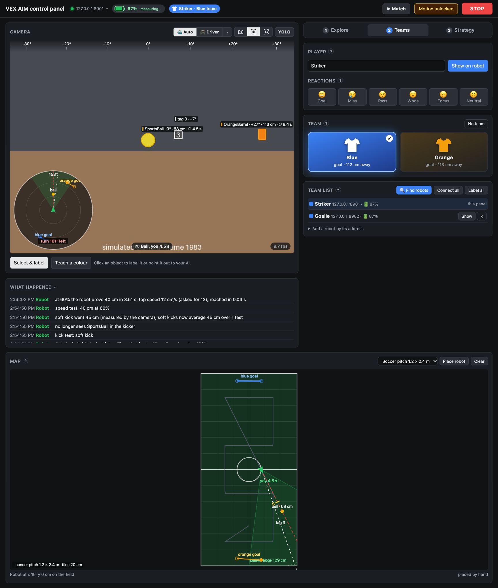
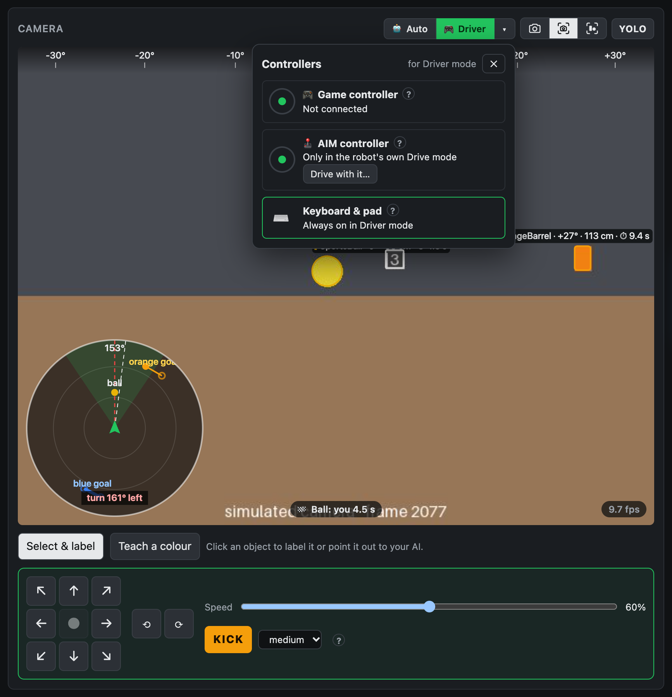
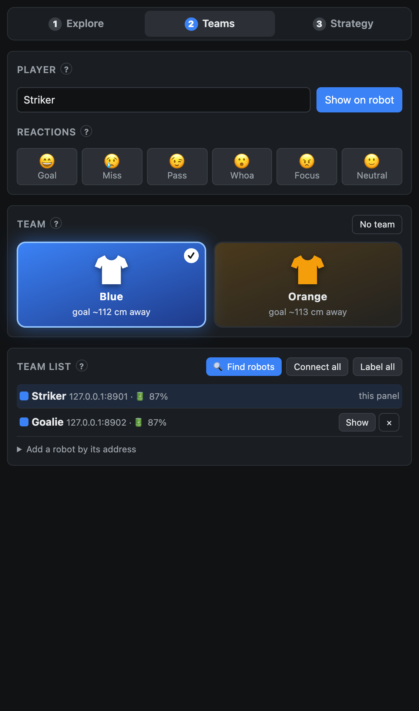
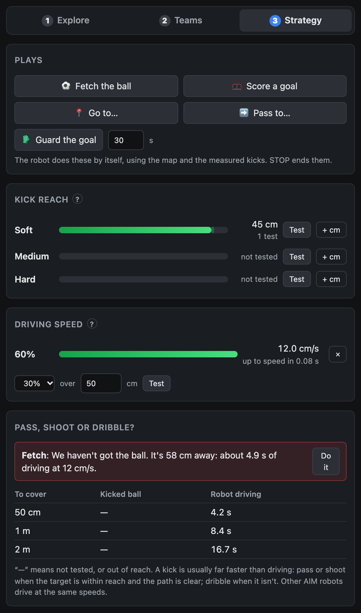

# The control panel

This page explains the control panel: the web page where you see what the robot sees, drive it, and set up players,
teams and plays.

Installing and settings are in the [README](../README.md). Getting robots onto Wi-Fi is in [setup.md](setup.md).

## Opening the panel

- Ask your assistant to open the control panel (its `control_panel` tool).
- It opens at http://127.0.0.1:8765. If your AI app has a browser pane, the assistant can show the panel there, next
  to the chat. Otherwise, open that address in a browser on the same computer.
- It updates several times a second.
- Each panel session uses a secret token, so other websites in your browser can't send it commands.
- Your assistant sees what you do here, such as your team, your labels and what you point out.
  [tools.md](tools.md) explains how it uses them.

### Running it on its own

The panel also runs without an assistant:

```bash
vex-aim-panel --host 192.168.1.50
```

- Use your robot's address in place of 192.168.1.50.
- It opens the page in your browser. `--no-browser` stops that, `--port` changes the port (8765 by default), and
  `--no-yolo` skips YOLO.
- If you haven't installed the package, run it through `uvx`, the same way as the README's
  [Try it without a robot](../README.md#try-it-without-a-robot).
- Don't run it while your assistant is connected to the robot. Ask the assistant to disconnect first
  (`disconnect_robot`), so only one program talks to the robot.

## The layout



- **Two columns:** the camera and the log on the left, and the **Explore**, **Teams** and **Strategy** tabs on the right.
- **The map** runs across the full width below.
- **The log** (**What happened**) lists what the robot, you and your assistant did, newest first.
- **A ?** next to a heading explains that card.

## Along the top

The header shows the robot's address, a battery gauge, the player's name and team, **▶ Match**, the motion lock and
**STOP**. It stays in view as you scroll.

- **The address** opens the [Wi-Fi menu](#the-wi-fi-menu).
- **The battery gauge:** the robot doesn't report whether it's plugged in, so the gauge reads it from the level.
  - Rising means charging: a bolt and "full in …".
  - Falling gives "… left".
  - It needs a few minutes of readings first.
  - Streaming video can use more power than USB charging gives, so a plugged-in robot may still go down while the
    panel shows video.
- **▶ Match** runs a match: an autonomous period (the robot, plays and your assistant), then driver control, then
  everything stops. While a match runs, the button shows the period and the time left.
- **🔒 Motion locked:** motion starts locked each time the robot connects. Click it to unlock motion once the robot is
  on the floor with clear space around it.
- **STOP** stops the robot, and ends any move, play or experiment, whoever started it.

## The Wi-Fi menu


Click the robot's address at the top to open **Wi-Fi networks**. This section describes its controls. For step-by-step
set-up, see [setup.md](setup.md).

From top to bottom:

- **The top line** shows the robot's address, the network it's on and its firmware version.
- **The Switch list:** choose **this robot** or **the whole team**. This picks which robots the **Switch…** buttons move.
- **The robot's network**, with **Remember**. Remember copies the robot's network into the Mac's keychain, password and
  all, without showing it.
- **Networks remembered on this Mac**, each with **Switch…**. Switch… sends this robot or the whole team to that
  network.
  - They leave at once, so join that network on the Mac too.
  - The panel then finds the robots again by itself (by their radios' hardware addresses) and reconnects.
- **Its own hotspot**, with **Switch…**. This switches the robot to Access Point mode, after remembering its network so
  you can switch back.
  - Join its `AIM-…` Wi-Fi on the Mac, and the panel reconnects.
  - While the Mac is on a robot's hotspot, it has no internet, so your assistant can't reply. The panel keeps working.
  - When the Mac is on a robot's hotspot, the menu offers **Use that robot**.
- **Add a network** (its **?** explains it):
  1. Press **📡 Scan**. It lists the networks near this Mac, strongest first, and greys out the ones a robot can't join
     (5 GHz only).
  2. Tap one, or pick from the networks this Mac has joined.
  3. Add its password. **🔑 From this Mac** uses the password the Mac saved for it, after macOS asks for your Mac's
     password. Otherwise, type it once, or leave it empty for an open network.
  4. Press **Remember network** to keep it for later, or **Switch…** to move the robots now.
- **Tips**, at the bottom, covers which networks work and what to do if a robot gets lost.

Good to know:

- **Which networks work:** AIM robots only join 2.4 GHz WPA2 networks, with names and passwords up to 20 characters, and
  no sign-in pages. [How an AIM robot connects](setup.md#how-an-aim-robot-connects) has the details.
- **The first scan** makes macOS ask you to let a tiny helper app, "AIM Wi-Fi Scan", use Location Services. macOS only
  shows Wi-Fi names to apps with that permission. No location is read or kept.
  [What macOS asks for](setup.md#what-macos-asks-for) explains each request.
- **Your assistant can't change networks.** Wi-Fi passwords are only handled by the panel and the keychain.

## The camera

Switch views with the icons at the top right of the camera card:

- **Camera:** the plain live picture, as everyone around the robot sees it.
- **Camera + AI:** the picture with what the robot's AI recognises drawn over it. Each shape is labelled with its
  bearing and distance, and a ball in the kicker glows.
- **AI only:** just the AI's shapes.
  - It sends no video over Wi-Fi (the robot stops streaming).
  - It updates about 10 times a second, faster than the video.
  - It shows the difference between the camera's pixels and what the AI actually knows.
- **YOLO** adds a second opinion from a bigger AI on this computer (dashed orange; about 10 s to load).
  - YOLO is optional. To get it, install the package's `yolo` extra: see [Options](../README.md#options) in the README.
  - The default model, `yolo26n.pt`, downloads the first time you use it.

### The minimap

- The minimap over the picture is a heading-up radar of the map. It shows the goal, and whether a kick now would score.
- Click it to tuck it away into a little sweeping radar. Click that to bring it back.

### Clicking in the picture

Below the picture, **Select & label** and **Teach a colour** choose what your mouse does.

- **Click an object** to label it, measure its distance, or point it out to your assistant. **Point out to…** (the
  button shows your assistant's name) tells your assistant about it, with an optional note.
- **Click a tag** to define it (see [Explore](#explore-map-the-arena)).
- **Teach a colour:** drag a box over any object, and the robot's AI learns its colour, as in VEXcode's AI Vision
  Utility. Give the colour a name, such as "red cup", and pick how close a match it needs: tight, normal or loose.

### Predictions

- Each label shows how long the robot would take to reach that object (⏱), from its
  [measured speed](#strategy-plays-and-experiments).
- **🏁 Ball** says who gets to the ball first: this robot, or another robot the map has seen.
- On the map, moving things get speed arrows, and a rolling ball shows where it will stop.

## Driver mode



Switch between **🤖 Auto** and **🎮 Driver** at the top of the camera card.

- In Driver mode you drive, and your assistant's movement tools and the robot's own jobs wait. If your assistant
  needs to move the robot, it asks you to switch back to Auto.
- Driving needs motion unlocked, like anything else that moves the robot.

**The drive pad**, below the camera:

- Hold its buttons, or use the keyboard: W A S D or the arrow keys move, Q and E turn, Space kicks, and holding Shift
  goes slowly.
- The robot stops the moment you let go.
- **Speed** sets how fast it drives. **KICK** kicks at the strength you pick: soft, medium or hard.

**The Controllers menu** (the **▾** next to Driver):

- **Game controller:** one paired with this computer (Xbox, PlayStation, Switch) drives too. The left stick moves, the
  right stick turns, and A kicks.
- **AIM controller:** see below.
- **Keyboard & pad:** always on in Driver mode.
- Each row's **?** has the details.

### The AIM controller

The **AIM One Stick controller** only works in the robot's own Drive mode (or in VEXcode projects running on the
robot). The robot doesn't pass it on over Wi-Fi, and Drive mode can't run while a program is connected. So:

1. Press **Drive with it…** in the Controllers menu. The panel lets go of the robot.
2. Tap **Drive** on the robot's screen.
   - To link a controller first: on the robot, Settings → Link Controller, then double-press the controller's power
     button.
3. When you're done, press **Back to the panel** to reconnect.

**Meanwhile, the panel has no camera, map or STOP.**

## The three tabs

The tabs follow a game from setting up to playing.

**Before anything moves:** scanning, exploring, plays and the Strategy tests all move the robot. They need motion
unlocked, so first check that the robot is on the floor with clear space around it. They run one at a time and stop
on a bump. **STOP** ends them, whoever started them.

### Explore: map the arena

- **Scan here** turns a full circle, putting everything it sees on the map.
- **Explore the field** drives a grid across the field chosen under [the map](#the-map), and scans at each spot. It
  goes around obstacles and anything already on the map.
- **AprilTags:** turn detection on, then click a tag to name it and make it a **marker** or an **obstacle**. Write
  what it means for your assistant, for example "corner: turn back to the middle".
  - Pin a marker to its place on the field. Whenever the robot sees a pinned marker (up to 1.5 m away), it works out
    where it is on the field from it. This corrects drift on big fields.
  - Obstacles get a red keep-out zone, 15 cm around the tag.
- **Camera range** shows how far away each kind of object has been spotted.
- **Taught colours** lists the robot's colours.

### Teams: players and the team list



- **Player:** type a name and press **Show on robot**. This puts a player card on the robot's round screen: the name
  in the team colour, with a small face, and its lights to match.
  - **Reactions** change the face: **Goal**, **Miss**, **Pass**, **Whoa**, **Focus** and **Neutral**.
- **Team:** pick the robot's team, **Blue** or **Orange**, or **No team**. A team scores in the goal of its own colour.
  Once the map has found the goals, each card shows how far away its goal is.
- **Team list:** every robot, with its name, team, address and battery. "this panel" marks the robot the panel shows.
  - **🔍 Find robots** looks for AIM robots on this Wi-Fi network.
  - **Blink** flashes one and rings, so you can see which it is.
  - **Pair…** puts it on the team with a name and team: it connects and shows its card.
  - **Add a robot by its address** adds one by hand.
  - **Connect all** connects every robot on the list. **Label all** shows each player's card on its robot.
  - **Show** makes the panel, and your assistant's tools, use that robot. **×** takes it off the list.
  - On a field, the other players appear on the map in their team colours.

For a classroom set, see [A classroom with many robots](setup.md#a-classroom-with-many-robots).

### Strategy: plays and experiments



- **Plays:** **Fetch the ball**, **Score a goal**, **Go to…** and **Pass to…** (click the map to choose where), and
  **Guard the goal**. The robot does them by itself, using the map and the measured kicks. STOP ends them.
  - **Guard the goal** plays goalkeeper in front of the goal the other team scores in, for the number of seconds you
    set (30 by default).
- **Kick reach:** the robot kicks, and its camera watches the ball roll to measure how far each strength goes.
  - Put the ball in the kicker, point the robot at open floor, then press **Test** for a strength.
  - If the ball rolls out of view, measure it yourself and enter it with **+ cm**.
- **Driving speed:** times a measured drive. Pick a speed and a distance, then press **Test**.
- **Pass, shoot or dribble?** gives the same advice as your assistant's `advise` tool, with **Do it** to carry it out.
  - Its table compares how long a kicked ball and the driving robot take to cover 50 cm, 1 m and 2 m.
  - "—" means not tested, or out of reach.

Measure first: the plays use the measured kicks, and the ⏱ times use the measured speed.

## The map

- It shows the robot, its path and everything it has seen, with distances.
- The menu at its top right shows it fitted to what's been seen (with distance rings), or as a field with its tiles:
  a desk (1 × 1 m), a soccer pitch (1.2 × 2.4 m), a VEX IQ field (6 × 8 ft) or a VEX V5 field (12 × 12 ft).
- On a field, start the robot facing up the field. Then use **Place robot**, or a pinned marker, so the map knows
  where the robot is.
- Kick reach shows as S, M and H ticks along the aim line.
- Moving things get speed arrows, and a rolling ball shows where it will stop.
- **Clear** clears the map.

## What the panel saves

The panel saves its set-up in `panel_setup.json`, in its data folder. On a Mac, that's
`~/Library/Application Support/VEX AIM Panel/`. To keep it somewhere else, set `AIM_PANEL_SETUP` to a file path (see
[Settings](../README.md#settings)).

It saves:

- measurements and abilities;
- tag roles, pins and meanings;
- the player, the team, the team list and the field;
- remembered network names (never passwords: those stay in the Mac's keychain);
- recent battery readings.

The map itself starts afresh with each connection.

## Trying it with the simulator

You can try the whole panel without a robot. Run the simulator and the panel, each in its own terminal window:

```bash
vex-aim-sim --world arena
vex-aim-panel --host 127.0.0.1:8899
```

- `--world` picks the scene: `barrel` (the default), `goals` or `arena`. `arena` is a 1.2 × 2.4 m soccer pitch: use it
  for exploring, kick tests and plays.
- `--ball-in-kicker` starts the arena with the ball in the kicker.
- `--port` changes the simulator's port (8899 by default).
- `vex-aim-arena --robots 4` puts four simulated robots on one pitch, on ports 8899, 8900 and so on. Point the panel at
  the first, then add the others in the Teams tab with **Add a robot by its address**, for example `127.0.0.1:8900`.
- The simulator serves a set-up page like the real robot's, so you can try the Wi-Fi menu too.
- If you haven't installed the package, run these through `uvx`, as in the README's
  [Try it without a robot](../README.md#try-it-without-a-robot).
