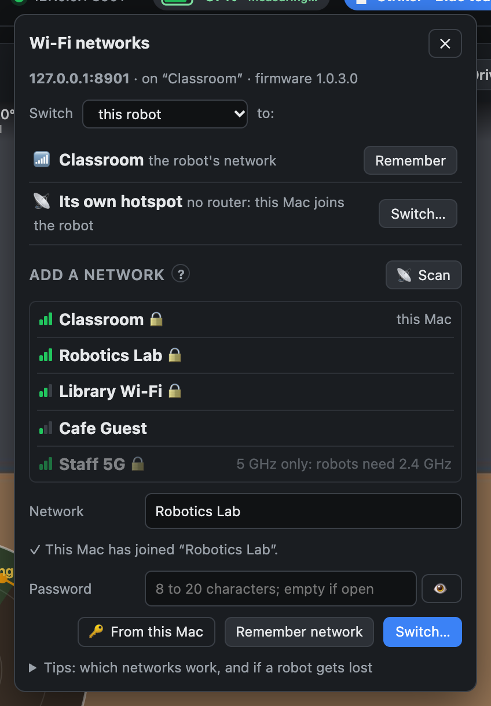

# Setting up robots and Wi-Fi

How to get AIM robots onto a Wi-Fi network with your computer: one robot at home, a classroom set, or a team at a
competition somewhere new. The [README](../README.md) covers installing; [control-panel.md](control-panel.md)
describes the panel's Wi-Fi menu screen by screen.

## How an AIM robot connects

An AIM robot's radio has three modes. You choose one on its screen, under Settings → Radio:

| Mode | What it's for |
|---|---|
| **Station** | The robot joins an existing Wi-Fi network. This is what this project uses: your computer keeps its internet, so Claude keeps working. |
| **Access Point** | The robot makes its own Wi-Fi hotspot, called `AIM-…`, at 192.168.4.1. Good for setting a robot up; not for using Claude, because a Mac on the robot's hotspot has no internet. |
| **Bluetooth** | For VEXcode. Not used here. |

A robot remembers one network. If it can't join it (you're somewhere else, or the password changed), it keeps trying
until you put it on its own hotspot and give it a new network.

**What networks work.** AIM robots join:
- **2.4 GHz** networks only (channels 1 to 11). Many routers run 2.4 and 5 GHz under one name, which is fine.
- WPA2 or open networks, with a **name and password of up to 20 characters** each.
- Networks with **no sign-in page**: not school "enterprise" logins, and not guest networks that keep devices apart
  from each other.

The robot gets its address from the router (DHCP), and it can change from day to day.

## One robot, on your Wi-Fi

1. On the robot: Settings → Radio. If it shows **Station** and an address, it's on a network.
2. Check that's your computer's network, and put the address in `AIM_HOST` (see the [README](../README.md#install)).
3. Ask Claude to connect. If it can't, the robot may be asleep (tap its screen) or on another network.

## A new robot, or a new network

The easiest way is with the control panel:

1. Put the robot on its own hotspot: on its screen, Settings → Radio → Access Point. (If the robot is already
   connected to the panel, its Wi-Fi menu can do this: **Its own hotspot → Switch…**.)
2. On your Mac, join the robot's `AIM-…` Wi-Fi. Its password is on the robot's screen.
3. Open the control panel. It notices it's on a robot's hotspot and offers **Use that robot**.
4. In the Wi-Fi menu, under **Add a network**, press **📡 Scan** and pick your network, or pick one this Mac has
   joined before. Add its password, or press **🔑 From this Mac** to use the one your Mac saved. Then press **Switch…**.
5. Join the same network on your Mac again. The panel finds the robot at its new address by itself and reconnects.

Steps 2 to 5 happen without internet, so Claude can't reply then, but the panel keeps working. Open the panel
before you start (ask Claude to), or run it yourself with `vex-aim-panel`.

You can also do this without the panel, from a browser: VEX's
[Station mode guide](https://api.vex.com/aim/home/websocket/wifi_setup/connection_sta.html) uses the robot's own
set-up page at http://192.168.4.1.

## A classroom with many robots

- **Use a network just for the robots** if you can. The robots' control connection has no password, so anyone on the
  same network can drive them. The robot's set-up page also shows its Wi-Fi password to anyone who opens it.
- **Name each robot.** In the panel's Teams tab, **🔍 Find robots** lists every AIM robot on the network. **Blink**
  flashes one and rings, so you can tell which is which. **Pair…** puts it on your team list with a name and a team,
  and its screen shows its player card.
- **One program per robot.** Only one program should drive a robot at a time. Ask Claude to disconnect before using
  VEXcode or a script with it.

## Competitions and other venues

- **Bring a travel router.** Set every robot to it once, at home, and reserve each robot's address in the router.
  Then nothing about the robots changes at a new venue: you plug in the router and play.
- **Or use the venue's Wi-Fi.** Get its name and password ahead of time, then:
  1. At home, in the Wi-Fi menu, add the venue's network and press **Remember network**. Press **Remember** on your
     home network's row too, so you can come back to it.
  2. Still at home, choose **the whole team** in the menu's Switch list, and press **Switch…** on the venue's network.
     The robots leave your network and keep looking for the venue's, so they join it as soon as you arrive.
  3. At the venue, join its Wi-Fi on your Mac and open the panel. **🔍 Find robots** finds them, and the team list
     follows each robot to its new address: the panel recognises a robot by its radio's hardware address.
  4. Before you leave, switch the whole team back to your home network the same way.

  If a robot can't join the venue's network (a wrong password, or a 5 GHz-only network), put it on its own hotspot
  and switch it from there, as in [A new robot, or a new network](#a-new-robot-or-a-new-network).

## What macOS asks for

The panel uses a few macOS features, and macOS asks you before each one is first used:

- **Location Services for "AIM Wi-Fi Scan".** macOS only shows the names of nearby Wi-Fi networks to apps allowed to
  use Location Services. The panel can't be given that permission, so the scan runs in a tiny helper app,
  "AIM Wi-Fi Scan", built on your Mac the first time you press **📡 Scan**. It never reads or keeps your location.
  It needs Xcode's command-line tools (`xcode-select --install`). Without them, pick from the networks the Mac has
  joined instead.
- **Your Mac's password, for 🔑 From this Mac.** Wi-Fi passwords your Mac has saved are in its System keychain, and
  macOS asks for your Mac's password before handing one over.
- **The keychain, for remembered networks.** Remembered passwords are kept in your login keychain, under
  "VEX AIM venue Wi-Fi". The panel's saved set-up keeps only the networks' names.

Claude itself never sees or handles a Wi-Fi password: only the panel and the keychain do.
